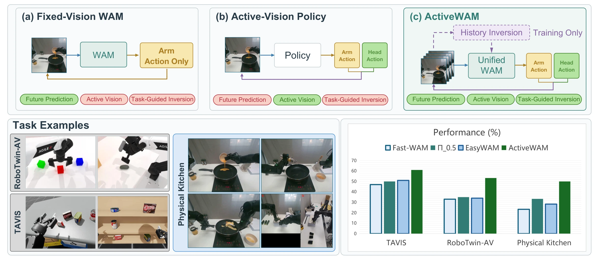
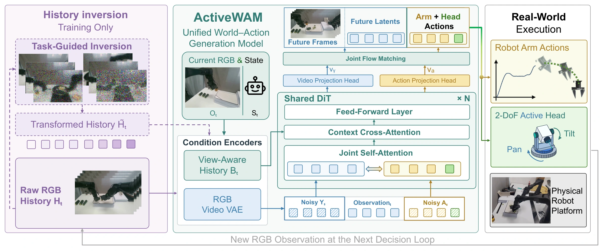

<h1 align="center">
ActiveWAM: Evidence-Aware Active Vision for World-Action Models
</h1>

  <a href="https://icr-lab.github.io/ActiveWAM/">Project Page</a> |
  arXiv (coming soon) |
  <a href="https://github.com/Soraruholic/RoboTwin-AV">RoboTwin-AV</a>

  

ActiveWAM is a unified world-action model for active-vision manipulation. It treats camera control as an evidence-aware **retain-acquire** problem: the policy learns which task-relevant evidence should survive view changes and jointly decides how to move the head and the arms.

## Overview

Active vision manipulation changes both the robot state and the evidence available to the next decision. A new view can expose an occluded relation, but it can also move a previously useful cue out of a finite history window. ActiveWAM addresses this coupling with three components:

- **Task-guided history inversion.** During training, a frozen video prior transforms observed RGB histories while preserving task-bearing source evidence and visible temporal changes. The original action continuation and future-video target remain fixed.
- **View-aware history.** Camera identity, measured pan/tilt, frame age and validity are encoded together with RGB history, so the model can distinguish a camera change from a scene change.
- **Unified head-arm generation.** One world-action generator produces bimanual actions and executable 2-DoF pan/tilt actions, including a valid stay action. At deployment, the policy uses raw observations, executes a short prefix, and updates context from newly measured RGB.

Inversion is training-only: deployment requires neither online inversion, candidate ranking, optimal-viewpoint labels nor future-video decoding. Future-video prediction is used as a co-training signal for the action policy.

  

## Benchmarks and evaluation

We introduce **RoboTwin-AV**, a 50-task extension of RoboTwin 2.0 with executable pan/tilt control, synchronized RGB and automatically generated demonstrations. We also evaluate on the independently released **TAVIS** benchmark, fixed-camera generalization suites and a physical dual-arm kitchen setup. The project page contains source-aligned RGB demonstrations, head-pose visualizations, task-guided history-inversion studies and the current evaluation protocols.

## TODO List

- &#9744; Release the ActiveWAM training code
- &#9744; Release the evaluation and data-processing code
- &#9744; Release pretrained checkpoints
- &#9744; Release the arXiv paper and supplementary material
- &#9744; Add reproducible setup instructions for RoboTwin-AV and TAVIS

## Citation

The citation will be added after the arXiv submission.

## License

The code and checkpoint license will be specified with the first public release.
